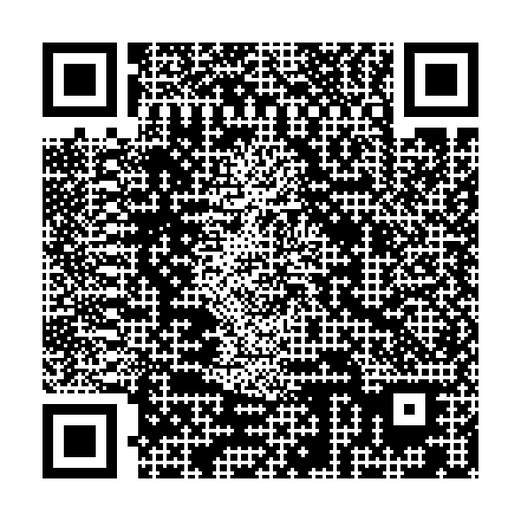
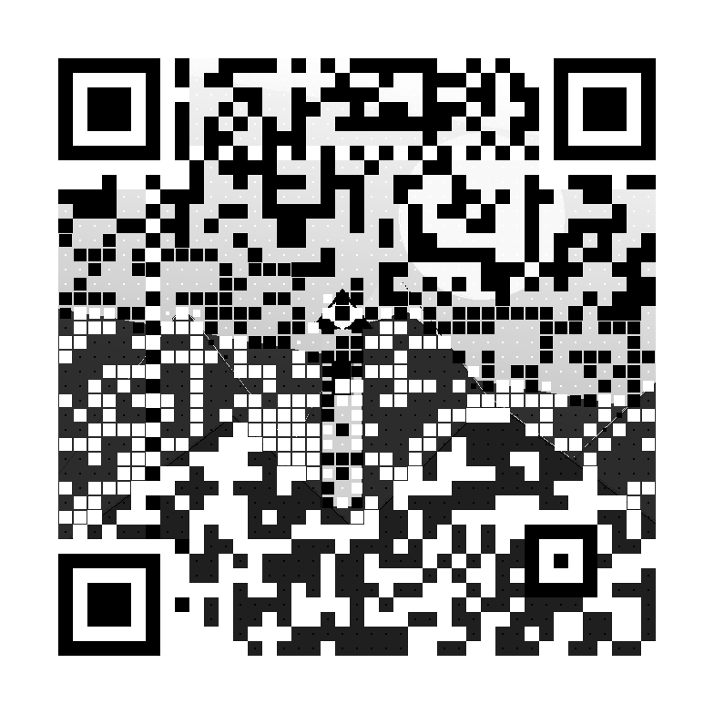
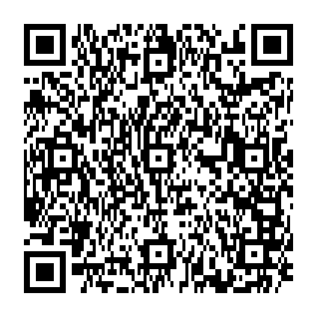

# Photo Dither QR

Python-генератор художественных QR-кодов. Базовый режим вплетает фотографию в QR с помощью двухпроходного дизеринга с распространением ошибки; ещё три экспериментальных режима основаны на идеях из исследований ART-UP, Text2QR и Dueling QR Codes.

Изначальный алгоритм вдохновлён [генератором Andrew Taylor](https://www.andrewt.net/dithered-qr-codes/wtf/).

Репозиторий: [github.com/inlanger/photo-dither-qr](https://github.com/inlanger/photo-dither-qr)

## Режимы

| Режим | Команда | Что получается |
| --- | --- | --- |
| Dither | по умолчанию | Контрастный чёрно-белый QR с фотографией в сетке 3×3 |
| ART-UP | `--method art-up` | Dither QR с оценкой вероятности сканирования и локальным ремонтом слабых модулей |
| Text2QR blueprint | `--method blueprint` | Полутоновый CPU-only blueprint без diffusion-модели |
| Dueling QR | `duel` | Один экспериментальный QR с двумя сообщениями, выбираемыми углом обзора |

## Установка

```bash
python3 -m venv .venv
source .venv/bin/activate
python -m pip install -e .
```

## Использование

Обычный dither QR:

```bash
dithered-qr photo.jpg "https://example.com" -o qr.png
```

ART-UP-inspired ремонт и карта уверенности:

```bash
dithered-qr photo.jpg "https://example.com" -o art-up.png \
  --method art-up \
  --strength 0.65 \
  --heatmap confidence.png
```

Чем выше `--strength`, тем выше модельная оценка уверенности модулей и тем меньше деталей фотографии. Это proxy, а не гарантия физического сканирования. Значение по умолчанию — `0.65`; в статье ART-UP исследуется диапазон `0.75–0.90`.

Text2QR-inspired blueprint:

```bash
dithered-qr photo.jpg "https://example.com" -o blueprint.png \
  --method blueprint \
  --strength 0.6 \
  --module-size 16
```

Для blueprint параметр `--strength` задаёт робастность: `0.5 <= strength < 1.0`.

Dueling QR с двумя ссылками:

```bash
dithered-qr duel \
  "https://example.com" \
  "https://github.com/inlanger/photo-dither-qr" \
  -o dual.png \
  --split vertical
```

`vertical`, `horizontal` и `diagonal` меняют направление разделения. Прямой скан Dueling QR намеренно неоднозначен: он может не сработать или вернуть любую из ссылок. Результат зависит от камеры, угла, размера и печати. Не используйте этот режим для оплаты, авторизации и других чувствительных ссылок.

То же самое без установленной команды:

```bash
python -m dithered_qr photo.jpg "https://example.com" -o qr.png
```

Все параметры доступны через `dithered-qr --help` и `dithered-qr duel --help`.

## Готовые примеры

| Режим и содержимое | Исходное изображение | Результат |
| --- | --- | --- |
| Dither · [example.com](https://example.com) | [](examples/demo-source.png) | [](https://example.com) |
| Dither · [этот репозиторий](https://github.com/inlanger/photo-dither-qr) | [](examples/portrait-source.png) | [](https://github.com/inlanger/photo-dither-qr) |
| ART-UP · [этот репозиторий](https://github.com/inlanger/photo-dither-qr) | [](examples/portrait-source.png) | [](https://github.com/inlanger/photo-dither-qr)<br>[Карта уверенности](examples/art-up-heatmap.png) |
| Text2QR blueprint · [example.com](https://example.com) | [](examples/demo-source.png) | [](https://example.com) |
| Dueling · [example.com](https://example.com) + [репозиторий](https://github.com/inlanger/photo-dither-qr) | — | [](examples/dueling-qr.png) |

Обе исходные картинки лежат в `examples/` и подходят для немедленного запуска. `demo-source.png` — контрастная иллюстрация, а `portrait-source.png` — AI-сгенерированный фотореалистичный портрет.

## Python API

```python
from PIL import Image
from dithered_qr import generate_art_up_qr

with Image.open("photo.jpg") as source:
    result = generate_art_up_qr("https://example.com", source)

result.save("qr.png")
```

Публичный API также экспортирует `generate_dithered_qr`, `generate_blueprint_qr` и `generate_dueling_qr`.

## Что именно взято из исследований

- [ART-UP: A Novel Method for Generating Scanning-robust Aesthetic QR codes](https://arxiv.org/abs/1803.02280) — реализована clean-room модель уверенности модуля: гауссово распределение точки выборки, локальный порог бинаризации и итеративное исправление свободных субпикселей. Модель служит proxy, не ISO-верификатором. Это не полное воспроизведение многоступенчатого binary/grayscale/color pipeline статьи.
- [Text2QR: Harmonizing Aesthetic Customization and Scanning Robustness for Text-Guided QR Code Generation](https://arxiv.org/abs/2403.06452) — реализованы CPU-only этапы histogram polarization и adaptive centered-square halftoning из QR Aesthetic Blueprint. Неописанная в статье функция реорганизации модулей заменена безопасным выбором среди восьми стандартных QR-масок. Stable Diffusion и SELR здесь нет.
- [Dueling QR Codes: The Hyding of Dr. Jeckyl](https://arxiv.org/abs/2503.13458) — два QR используют одну версию, уровень коррекции и маску; пополам делятся только data-модули, а служебные паттерны сохраняются целиком. Тесты подтверждают обе цифровые проекции, но не гарантируют результат физической съёмки.

## Как работает базовый dither

1. QR-модуль делится на сетку 3×3. В центре остаётся обязательный бит QR, остальные восемь пикселей доступны изображению.
2. Ошибка яркости от обязательного центрального бита распределяется между его восемью соседями.
3. Свободные пиксели переводятся в чёрно-белые алгоритмом Floyd–Steinberg.
4. Finder-, timing-, alignment- и остальные служебные модули сохраняются полностью, а вокруг результата добавляется стандартная светлая рамка шириной 4 QR-модуля.

Готовая бинарная сетка увеличивается только целым множителем и без сглаживания. Это сохраняет резкие границы модулей.

## Проверка

```bash
python -m pip install -e '.[test]'
pytest
```

Тесты проверяют геометрию, неизменность служебных модулей, математические инварианты новых методов и декодируют результаты независимым движком ZXing-C++.

Художественный QR всегда менее устойчив, чем обычный. Перед печатью проверьте его несколькими телефонами, на нужном размере, расстоянии и при плохом освещении.
