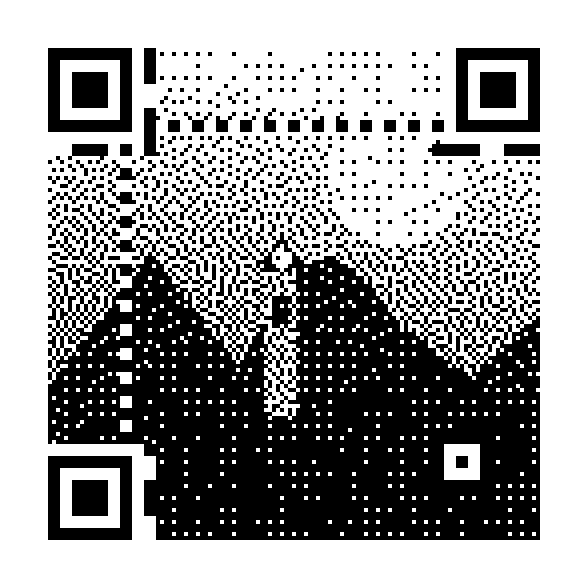
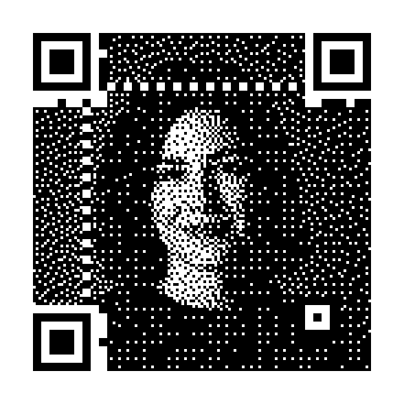

# Photo Dither QR

Python-генератор QR-кодов, в которые фотография вплетается с помощью двухпроходного дизеринга с распространением ошибки. Идея и алгоритм вдохновлены [генератором Andrew Taylor](https://www.andrewt.net/dithered-qr-codes/wtf/).

Репозиторий: [github.com/inlanger/photo-dither-qr](https://github.com/inlanger/photo-dither-qr)

## Установка

```bash
python3 -m venv .venv
source .venv/bin/activate
python -m pip install -e .
```

## Использование

```bash
dithered-qr photo.jpg "https://example.com" -o qr.png
```

То же самое без установленной команды:

```bash
python -m dithered_qr photo.jpg "https://example.com" -o qr.png
```

Полезные настройки:

```bash
dithered-qr photo.jpg "https://example.com" -o qr.png \
  --contrast 1.2 \
  --brightness 0.05 \
  --mask 3 \
  --min-version 6
```

Все параметры доступны через `dithered-qr --help`.

## Готовые примеры

| Ссылка внутри QR | Исходное изображение | Готовый QR |
| --- | --- | --- |
| [https://example.com](https://example.com) | [](examples/demo-source.png) | [](https://example.com) |
| [Этот репозиторий](https://github.com/inlanger/photo-dither-qr) | [](examples/portrait-source.png) | [](https://github.com/inlanger/photo-dither-qr) |

Обе исходные картинки лежат в `examples/` и подходят для немедленного запуска:

```bash
dithered-qr examples/demo-source.png "https://example.com" \
  -o examples/example-com-qr.png

dithered-qr examples/portrait-source.png \
  "https://github.com/inlanger/photo-dither-qr" \
  -o examples/repository-qr.png
```

`demo-source.png` — простая контрастная иллюстрация, а `portrait-source.png` — AI-сгенерированный фотореалистичный портрет. Так можно сравнить поведение алгоритма на графике и фотографии.

## Python API

```python
from PIL import Image
from dithered_qr import generate_dithered_qr

with Image.open("photo.jpg") as source:
    result = generate_dithered_qr("https://example.com", source)

result.save("qr.png")
```

## Как это работает

1. QR-модуль делится на сетку 3×3. В центре остаётся обязательный бит QR, остальные восемь пикселей доступны изображению.
2. Ошибка яркости от обязательного центрального бита распределяется между его восемью соседями.
3. Свободные пиксели переводятся в чёрно-белые алгоритмом Floyd–Steinberg.
4. Finder-, timing-, alignment- и остальные служебные модули сохраняются полностью, а вокруг результата добавляется стандартная светлая рамка шириной 4 QR-модуля.

Готовая бинарная сетка увеличивается только целым множителем и без сглаживания. Это сохраняет резкие границы модулей.

## Проверка

```bash
python -m pip install -e '.[test]'
pytest
```

Тесты проверяют геометрию, неизменность служебных модулей и декодируют готовый PNG независимым движком ZXing-C++.

Художественный QR всегда менее устойчив, чем обычный. Перед печатью проверьте его несколькими телефонами, на нужном размере, расстоянии и при плохом освещении.
